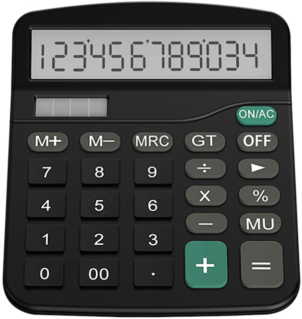
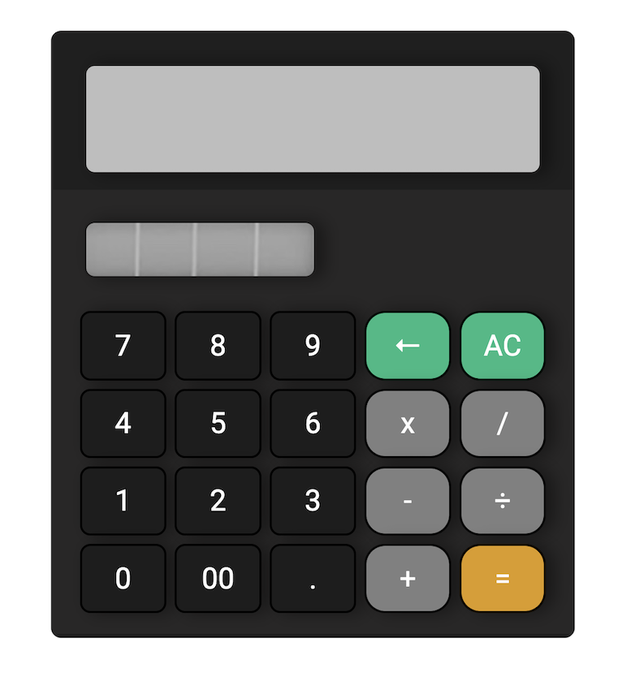

# Calculator Project

### Photo of Calculator:

### Our Calculator:

## MVP (Summarised):

### Javascript

-   Our calculator should render a calculation in a display
-   it should also handle decimals
-   should handle at least 2 numbers
-   DO NOT USE EVAL() OR FUNCTION()

### HTML & CSS

-   An image of a calculator from the internet will be reproduced using HTML & CSS
-   Number keys 1-9 (including 0), operator keys (+, -, x, /) and period key (.) should be usable
-   Order of operations does not need to be supported

### Hurdles Encountered

-   My initial render of the calculator accidentally included the use of Eval(). Upon reviewing the MVP and realising this did not satisfy project conditions, this had to be removed.

-   Finding a way to get our calculator to store at least 2 numbers was an issue for a couple of days. Once this was solved, other aspects such as storing the appropriate operator as well as getting the equal button to work was fairly straightforward.

### Coding decisions

-   A big aim I had in this project was to minimise my JS code as much as possible. Utilising iterators and switch statements help to flatten out my code quite substantially. My SCSS file was not quite as trimmed down with the vast majority of focus being dedicated to getting the calulator to work.

### Calculator Functionalities

-   supports use of basic operators such as +, -, x and /.
-   can handle up to 2 numbers
-   has an option to clear all numbers OR backspace just the last key entered.
